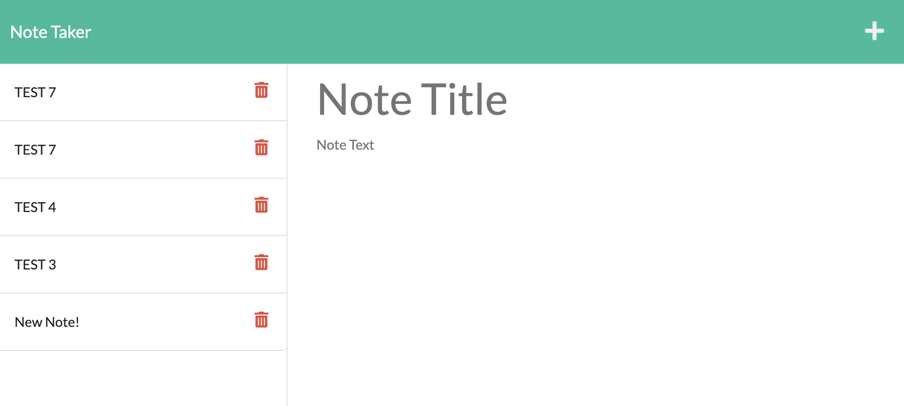
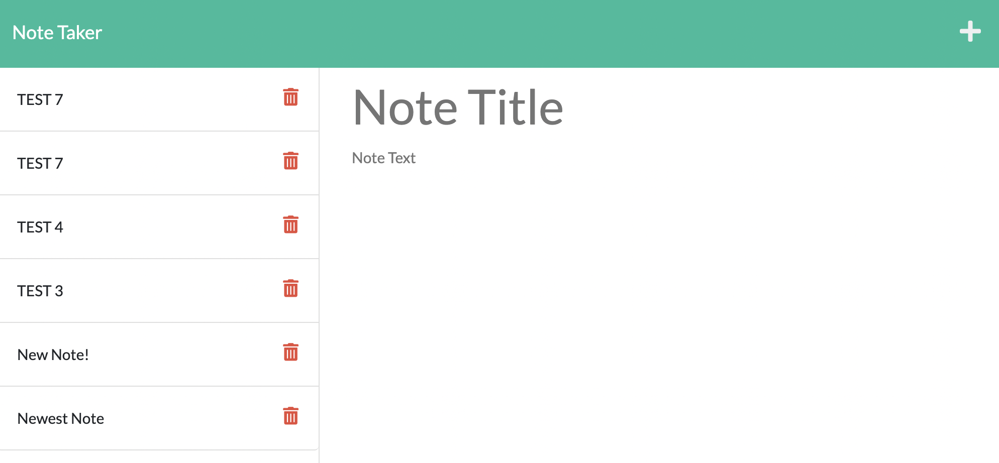

## Pencil-Pushing

## Table of Contents 
 1. [Screenshots](#screenshots)
 2. [Description](#description)
 3. [Deployed Link](#deployed-link)
 3. [User Story](#user-story)
 4. [Installation](#installation)
 5. [Utilized With](#utilized-with)
 6. [license](#license)

 
 ## screenshots
 - 
 - 

 ## deployed Link
 [heroku link](https://pencil-pushing.herokuapp.com/)
 
 ## description 
 - As the project already contained starter code, it was my goal, as a developer, to utilize the backend with Express.js. Together, these connect, and allow the user to write, edit, and delete notes. 

 ## user story
- AS A small business owner
- I WANT to be able to write and save notes
- SO THAT I can organize my thoughts and keep track of tasks I need to complete

## installation

1.) In VS code run `npm start`, and open a browser to localhost:3001.

Or,

2.) Use the link provided below to make notes. (-:
 

## utilized-with

* HTML, JS, and CC (via starter code)
* Node
* JSON
* Express
* UUID v4

## license

None.
